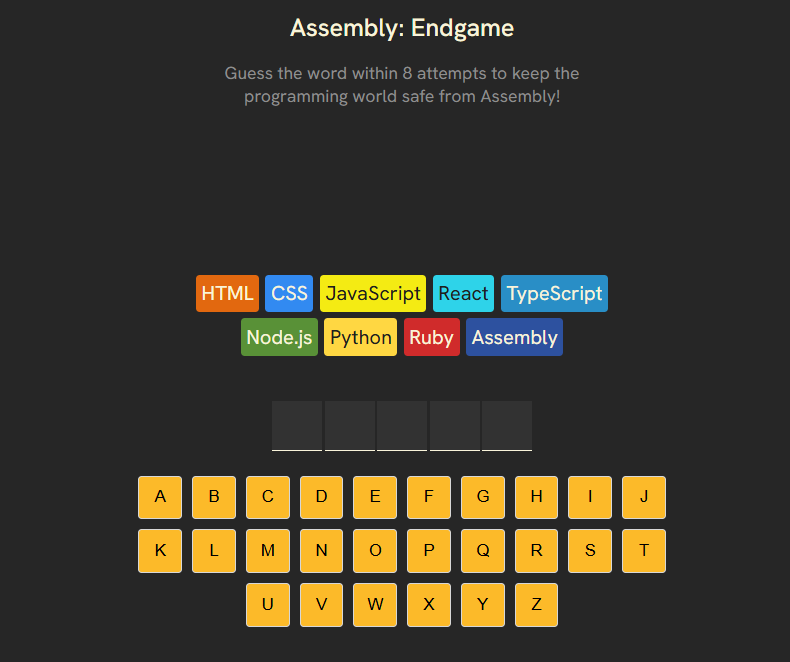
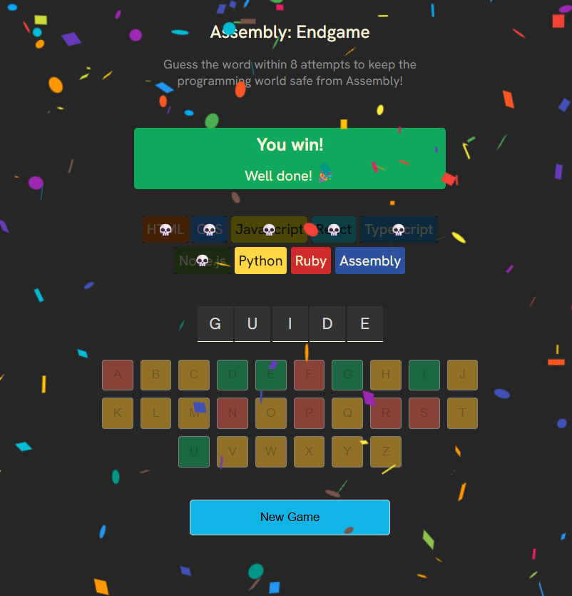
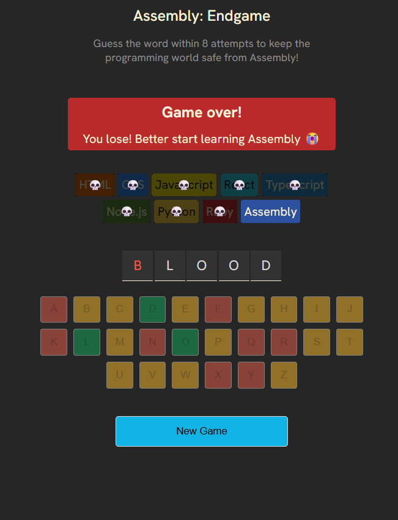

# 🎯 Assembly Endgame

A fun word-guessing game built with React where players try to save the programming world by guessing the hidden word before all programming languages are eliminated.

## 🚀 Live Demo

🔗 Add your deployed link here

---

## 📖 About The Project

Assembly Endgame is inspired by word-guessing games like Hangman.

The goal is simple:

- Guess the hidden word one letter at a time.
- Every incorrect guess eliminates a programming language.
- Win by revealing the complete word before all languages are lost.
- Lose if every language gets eliminated before the word is guessed.

---

## ✨ Features

- Interactive word guessing gameplay
- Dynamic keyboard input
- Win and loss detection
- Programming language elimination system
- Responsive UI
- Random word generation
- Color-coded game states
- Restart game functionality

---

## 🛠️ Built With

- React
- JavaScript (ES6+)
- Vite
- CSS3

---

## 📂 Project Structure

```text
assembly-endgame/
│
├── public/
│
├── src/
│   ├── assets/
│   ├── App.jsx
│   ├── index.css
│   ├── languages.js
│   ├── main.jsx
│   ├── utils.js
│   └── words.js
│
├── .gitignore
├── eslint.config.js
├── index.html
├── package.json
├── package-lock.json
├── README.md
└── vite.config.js
```

---

## ⚙️ Installation

Clone the repository:

```bash
git clone https://github.com/nancysangani/assembly-endgame.git
```

Navigate into the project:

```bash
cd assembly-endgame
```

Install dependencies:

```bash
npm install
```

Run the development server:

```bash
npm run dev
```

Build for production:

```bash
npm run build
```

Preview production build:

```bash
npm run preview
```

---

## 🎮 How To Play

1. Start the game.
2. Click letters to make guesses.
3. Correct guesses reveal letters in the word.
4. Incorrect guesses eliminate programming languages.
5. Guess the complete word before all languages are eliminated.

---

## 📸 Screenshots

### Game Start



### Winning Screen



### Losing Screen



---

## 🧠 Learning Outcomes

Through this project I practiced:

- React Components
- State Management with Hooks
- Conditional Rendering
- Array Methods
- Event Handling
- Component-Based Architecture
- Vite Project Setup

---

## 🤝 Contributing

Contributions, issues, and feature requests are welcome.

Feel free to fork the repository and submit a pull request.

---

## 📄 License

This project is licensed under the MIT License.

---

## 👨‍💻 Author

Nancy

GitHub: https://github.com/nancysangani